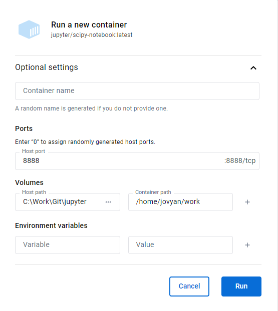

# jupyter
A collection of Jupyter notebooks I use to work with my data/test results. 
To run Jupyter on Docker: 
Install Docker for your platform, this should be easy to find. 
Makes it easier to set things up to run non-root: 
https://docs.docker.com/engine/install/linux-postinstall/#manage-docker-as-a-non-root-user 
TL;DR 
`sudo groupadd docker` # might respond with: groupadd: group 'docker' already exists 
`sudo usermod -aG docker yourusername` 
Log out and log back in 
`docker run hello-world` # test without sudo 
 
To pull the latest image 
`docker pull jupyter/scipy-notebook` 
Rerun above pull command to update image 
Run command below in the dir that contains the notebooks (Linux) 
`docker run -p 8888:8888 -v $(pwd):/home/jovyan/work jupyter/scipy-notebook` 
Or if running Docker Desktop (Windows) 
 
Follow instructions in log to access Jupyter 
Double click on work dir to see files from pwd 
Short version of instructions found at: 
https://towardsdatascience.com/how-to-run-jupyter-notebook-on-docker-7c9748ed209f 
